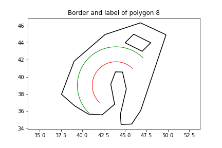
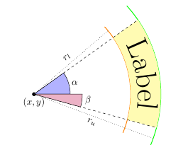

# Area Labeling



This project implements a small library for computing curved area labels.

An **area** is given by an closed outer Polygon, i.e. a sequence of points in the plane:
$x_1, y_1, x_2, y_2, ... , x_n, y_n$

where the segment $(x_n, y_n)-(x_1, y_1)$ closes the ring.

An optional set of holes each are of the same form and completely contained in the outer polygon.

An **curved area label** is a label which is curved along a circular arc.
The label is completely contained within the boundary polygon and does not intersect its holes.
By searching for a position which allows a maximum size of the label we try to provide a good readability of the label.

The label is of the following form (see figure below for an illustration)


The library at hand computes such a label automatically.


## Getting started

Clone the repository to your local machine:

    > git clone https://github.com/krumpefp/area_labeling.git

Go to the standalone_lib subproject ...

    > cd standalone_lib

... create a build folder ...

    > mkdir build

... and build the project

    > cmake ..
    > make -j4

Now you can use the command line interface to compute the labelling for a polygon area.
The example below computes the area label given in the above example.

```
> ./bin/labeling
Let's compute a curved area label!
Give the label aspect ratio A = H/W: 0.2
Give the sequence of coordinates defining the outer boundary: 
49.789472 44.936342 46.827233 36.076090 45.769290 34.492104 44.532311 34.450607 44.450931 35.633369 45.142662 38.601517 44.703209 40.574052 43.873131 40.594818 43.327884 39.148235 43.775475 36.809409 42.310631 35.571113 40.707441 35.654121 39.096113 36.629532 37.566165 37.971806 39.039147 41.840916 42.660566 44.964048 46.802819 46.328686
Enter i to insert a hole (c to continue): i
Give the sequence of coordinates defining the boundary of the hole: 
45 44 46 45 48 44 47 43
Enter i to insert a hole (c to continue): c
Starting labeling ...
Constructing the polygon ...
... finished
Construncting the skeleton ...
... finished
The computed skeleton contains 13 many edges
Searching for longest paths ...
... finished. Found 10 candidate paths
Evaluating paths ...
... finished
Computed label was:
Center  (43.92956179079158, 39.01376572114957)
Radii   low: 2.766894782127091 up: 4.514003882894896
Angles  from: 0.7907166909282513 to: 3.947882464005985
As tuple: 
(43.92956179079158, 39.01376572114957, 2.766894782127091, 4.514003882894896, 0.7907166909282513, 3.947882464005985)
```


## The Library

The dynamic library provides a single function:

```c++
std::optional<AreaLabel> computeLabel(Aspect, Polygon&, Config);
```

### Aspect

The aspect ($A$) defines the ratio of with ($W$) to height ($H$) of the label bounding box, i.e. $A = \frac{H}{W}.
The aspect is a simple double value:
```c++
using Aspect = double;
```

### Polygon

The polygon is given by an outer boundary and a (possibly empty) list of holes.
Each of these polygons are given as a sequence of 2d points where the last point in the sequence is connected to the first one.

The definition of a polygon is given by the following cascade:
```c++
struct Point {
    double x, y;
};

struct Polyline {
    std::vector<Point> points;
};

struct Polygon {
    // The outer boundary.
    // The last point is connected to the first one to close the ring.
    Polyline outer;

    // The holes each are described by a Polyline where the last node is
    // connected to the first one to close the ring.
    std::vector<Polyline> holes;
};
```

### Config

The config struct defines some parameters for the search.
Modifying these parameters may increase the time required to find a label.
For understanding the parameters we refer to the description of the algorithm


# Links

Here should be a fix link to the (yet unpublished) paper.


# Acknowledgement

This work is joint work with Thomas Mendel at the FMI at the University of Stuttgart.